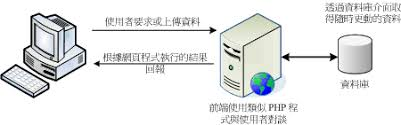

### 第六章 PHP 基本語法
#### PHP 基本觀念
+ 站台的運作方式
  + 靜態網站
    
    + 取自「鳥哥的私房菜」
  + 動態網站
    
    + 取自「鳥哥的私房菜」

+ PHP 的運作方式
  + PHP Engine
    

+ PHP 程式寫作方式
  + HTML 內嵌 PHP 程式標籤 :
    ```php
    <?php
      你的 php 程式碼;
    ?>
    ```
    + 範例 : hello.php
      ```html
      <!doctype html>
      <html lang="en">
        <head>
          <title>Hello World</title>
        </head>
        <body>
            <?php
              print "Hello World";
            ?>
        </body>
      </html>
      ```

    + 你的練習 : 請練習好下列步驟，以後章節將不會重複再說明！
      + 使用 VS Code 軟體
      + 使用 [View] -> [Extensions] -> 輸入[HTML] -> 確認是否安裝 [HTML Snippets]
      + 開新檔案，存檔成 hello.php ! 
        + 做法 [File] -> [Save As...] -> 選擇資料夾 -> 輸入檔名
      + 在 hello.php 頁籤中，實作 hello.php 內容
        + 選擇 hello.php 頁籤
        + 直接輸入 html ，在輔助視窗中，選擇 html:5
        + 在\<body\>標籤底下輸入範例內容！
        + 將檔案存檔
      + 將存好的檔案，使用 git 存好，並推上 github !
      + 進入你的正式環境內，將 github 的專案，克隆回你的主機！
        + 以 root 身份登入你的 Linux 主機
        + 切換至 /usr/share/nginx/html 目錄
          <pre><code>#cd /usr/share/nginx/html
          #git clone https://github.com/你的帳號名稱/你的專案名稱.git</code></pre>
      + 打開你的網頁，查看檔案是否有執行！
        + 請注意你的網址路徑是否正確

  + PHP 包含 HTML 標籤
    + 範例 : world.php
      ```php
      <?php
      print <<<_HTML_
          <form method="post" action="$_SERVER[PHP_SELF]">
          Your Name:<input type="text" name="user" />
          <br/>
          <button type="submit" class="btn btn-primary">Say World</button>
          </form>
      _HTML_;
      ?>
      ```
    + 範例 : world1.php
      ```php
      <?php
          print "<h5>test</h5>";
      ?>
      ```

  + PHP 基本輸出
    + 使用 echo 
    + 使用 print
    + 使用 printf() 函數
    + 例 : ex6_1.php
      ```php
      <?php
        echo "Hello <br />";
        echo 'World <br />';
        print "Hello2 <br />";
        print 'World2 <br />';
        printf("Hello World");
      ?>
      ```

  + PHP 的註解
    + 單行註解 : // or #
    + 區塊註解 : /*  */
    + 功能 :
      + 說明程式功能
      + 不執行程式
      + 其它
    + 範例 : ex6_2.php
      ```php
      <?php
        echo "你愛他 <br />";
        // echo '真的嗎？ <br />';
        print "他不愛你 <br />";
        /* 以下是猜的
        print '他有外遇 <br />';
        printf("你有外遇");
        */
      ?>
      ```

#### 變數
+ 變數 
  + 定義 : 利用一個名稱，暫時記錄某些資料。
  + 命名規則 :　$<變數名稱> 
    + 以 $ 為開頭
    + 變數名稱開頭字元為字母或底線，不能是數字！
    + 大小寫有別
  + 內容值的宣告:
    + '' or "" : 表示內容值是文字
    + 數字不需要使用 '' or ""
    + 變數若沒宣告內容值，則以預設值填入！
      + 整數、浮點數 : 0
      + 字串 : 空字串
      + 布林值 : false
      + 陣列 : 空陣列
  + 例 : ex6_3.php
    ```php
    <?php
        // 變數 a 沒宣告就使用,會產生 E_NOTICE 的警告
        echo '$a: '.$a.'<be />';
        $name = 100;
        echo '$name: '.$name.'<be />';
        $name = 'David';
        echo '$name: '.$name.'<be />';
        $a = $a + 100;
        echo '$a: '.$a.'<be />';
    ?>
    ```
+ 變數的存活範圍
  + 區域變數 : 變數的內容值只能在函數(function)內使用
  + 全域變數 : 變數的內容值可在整個程式內使用
  + 例 : ex6_4.php
    ```php
    <?php
      $x = 1;
      function hello($x){
        $sum = $x * 2;
        echo "函數執行結束 <br />";
      }
    ?>
    <p> -------我是分隔線------</p>
    <?php
      hello($x);
      echo "x=$x<br />";
      echo "sum=$sum<br />";
    ?>
    ```
+ 常數
  + 常使用，但永不改變的數值
  + 利用 define 函數定義常數名稱，方便記憶
  + 例 : ex6_5.php
    ```php
    <?php
      define('PI', 3.1415926);
      echo "圓周率：".PI;
    ?>
    ```
#### 資料型態
+ 標準資料型態
  + 整數(Integer) : 32 bits or 64 bits
    + PHP_INT_MAX : 該平台最大整數值
    + PHP_INT_SIZE : 該平台整數位元值大小
    + 運算過程中，若超出整數型態值，則自動轉成浮點數！
  + 浮點數(float) : 32 bits or 64 bits
    + 又稱實數(real)，專用於存放有小數點的數字資料型態
    + 因為 PHP 屬弱型別資料型態，所以 float or double 都是相同資料型態！
    + e : 科學表示法，表示以10為底的指數
      + 例 : 9.773e3 = 9773
  + 字串 : 沒有大小限制
    + 單引號 : 單引號中的變數不會轉成內容值
    + 雙引號 : 雙引號中的變數會轉成內容值
    + 跳脫字元 : 使用反斜線「 \ 」
      + \t : 相等於 [Tab] 鍵
      + \n : 換行，並移至行頭
      + \r : 換行
+ 複合類型
+ 特殊類型
#### 運算子
#### 參考文獻
+ [鳥哥的私房菜](http://dic.vbird.tw/linux_server/unit10.php)
+ [PHP 官網](https://www.php.net/)